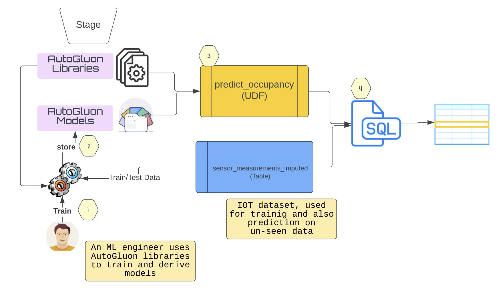
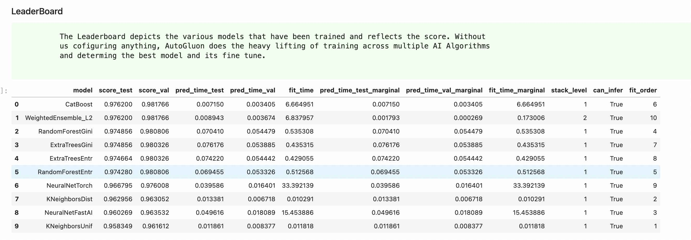
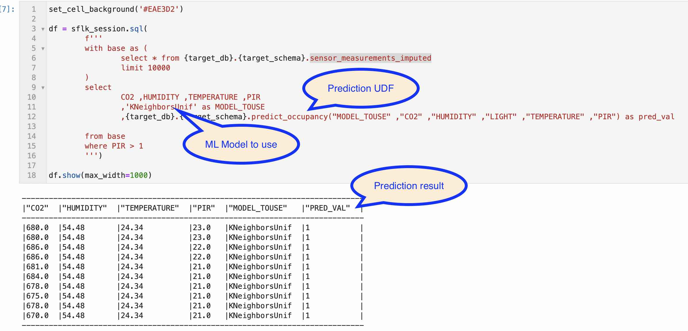

# Autogluon on Snowflake
A demonstration of using AutoML (AutoGluon) generated models natively in Snowflake

The main aim of this demo is to:
   - How [AutoGluon](https://auto.gluon.ai) can be natively used in Snowflake.
  
The following Snowflake features are demonstrated:
   - [Snowpark Python](https://docs.snowflake.com/en/developer-guide/snowpark/python/index.html)
   - [Python UDF](https://docs.snowflake.com/en/developer-guide/udf/python/udf-python.html)
   - [Vectorized UDF](https://docs.snowflake.com/en/developer-guide/snowpark/python/creating-udfs.html#using-vectorized-udfs-via-the-python-udf-batch-api)

### Audience
In order to get an undertanding of the flows and implementation logic, it is expected that
the audience has knowledge and experience in the following topics:
- [Snowpark for python](https://docs.snowflake.com/en/developer-guide/snowpark/python/index.html)
- Python
- [AutoGluon Tabular](https://auto.gluon.ai/dev/tutorials/tabular_prediction/tabular-quickstart.html)

## Scenario

Workplace occupancy is widely adopted use case in almost all sectors. In a typical office building, occupancy
is used to determine, if lights/air-conditioning etc should be running and saving on energy consumptions. This 
scenario also exists in Hospitals and Industrial settings too. Here are some articles, which would give a deeper
insights to this use-case:

 - [5 advantages of using workplace occupancy monitoring](https://www.pressac.com/insights/5-advantages-of-using-workplace-occupancy-monitoring/)
 - [Real-world Benefits of Occupancy Analytics](https://www.trueoccupancy.com/blog/real-world-benefits-of-occupancy-analytics)
 - [Measuring Mobility and Room Occupancy in Clinical Settings: System Development and Implementation](https://www.ncbi.nlm.nih.gov/pmc/articles/PMC7655473/)

Using the sample dataset from [Kaggle: Smart Building System](https://www.kaggle.com/datasets/ranakrc/smart-building-system),
which are essentially reading from various IOT sensors, we want to predict if a Room is occupied or not.

We use AutoGluon to develop a series of ML Models that are derived from various alogrithm for this classification use case.

### Solution Overview

1. An ML engineer uses AutoGluon libraries to train and derive models.
2. The models are packaged and stored in a stage.
3. An Python UDF is defined, which uses the AutoGluon library and the ml-models.
4. Inference is done using the UDF.

### Execution

The following leaderboard informs the various models that were derived
by AutoGluon as part of its training

Infering the class, is pretty much like running any other UDF call.

## Documentations

- [deployment](./doc/deployment.md)

## Limitations and References

**Q: Can I use any of the models trained by AutoGluon?**

A: Unfortunately **NO**. Not all models/algorithms can be used. The reason being that the 3rd party libraries (ex: autogluon.core-0.5.2-py3-none-any.whl)
can be extracted and imported as long as there are no native components/libraries. CatBoost & NeuralNetFastAI are examples of algorithms that 
cannot be used.

In the case of CatBoost it requires a native library '_catboost.so' that would not be able to be loaded. And in the case of NeuralNetFastAI
it requires FastAI which has a dependency of MatPlotLib. The MatPlotLib uses a native library hence it cant be loaded.

There are also certain algorithm that is not possible to use currently, for ex: NeuralNetTorch We need to use the PyTorch 1.12 version which is
used by AutoGluon and not the one from Snowflake Anaconda channel, which is of version 1.10. The PyTorch library is 750MB+ in size, hence when we 
extract it we run out of disk space. Currently the temp folder, which is where we use for libraries locally, is limited to 500MB.

**Q: What are the various models that AutoGluon currently supports?**

A: Refer to Doc: [autogluon.tabular.models](https://auto.gluon.ai/stable/api/autogluon.tabular.models.html)