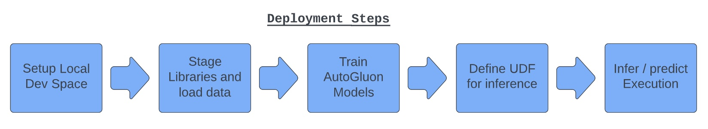
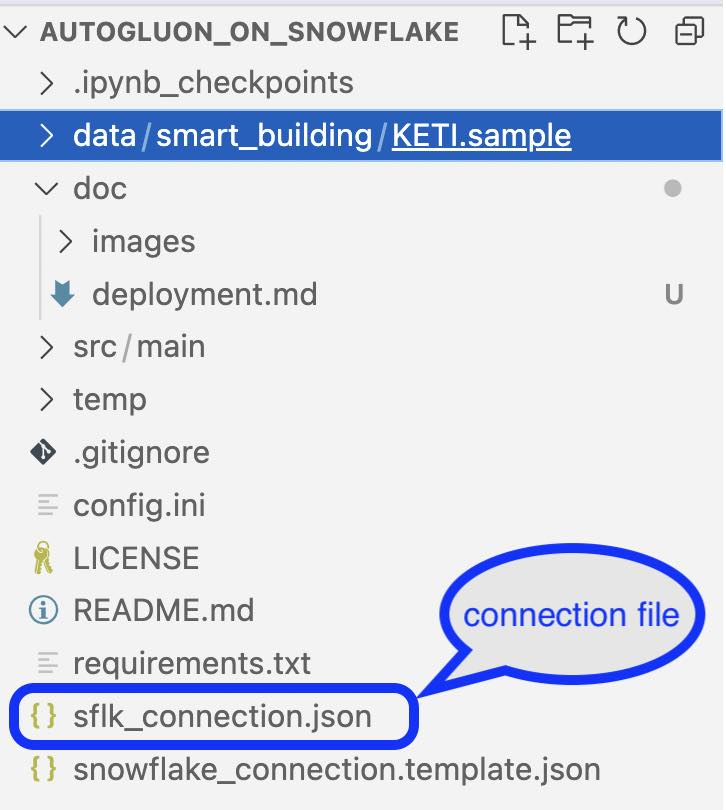

# Demo Setup & Deployment

The deployment involves a series of steps, peppered with multiple conceptual sections. Here are the high level activities that are involved for an End-to-End demo.



---
## Initial local machine setup

### ***Install Snowpark & libraries***

To keep it easier to understand documentation and code, I had adopted to using Snowpark and Jupyter notebooks. Hence 
it is assumed that you have these setup, if not refer to [Doc: Setting Up Your Development Environment for Snowpark Python](https://docs.snowflake.com/en/developer-guide/snowpark/python/setup.html#setting-up-your-development-environment-for-snowpark-python).

Also install the various libraries by using pip install with the [requirements.txt](./requirements.txt)
```sh
pip install -r requirements.txt
```

### ***Snowflake Connection Configurations***

The snowflake connection information is stored in json file. I had used the following json connection files:
- app_provider_connection.json: App provider connection info
- app_consumer_connection.json: Consumer connection info
These files are not checked into the repo, for obvious reasons. The format of these files similar to [snowflake_connection.template.json](./snowflake_connection.template.json). So before you start, create 2 different connection files and update the various configurations.





### ***Central configuration***

The code has been templatized as much as possible. The configuration file: [config.ini](../config.ini) holds the various values used when the artifacts gets deployed. This configuration is also the place where you would update the provider & consumer snowflake account id's.

You can change the value as needed.

---
## Steps

To help the user understand, I have broken down these steps into a series of notebooks.The following are the sections and the notebooks that have to be executed in the following order, the notebooks are grouped in this folder [src/main/notebook](../src/main/notebook):

| Section Number | Section | Description | Notebook |
|-------------|------------|-------------|----------|
| 1.0 | Setup | Involves creating a database and other objects specifically used for this demonstration. (Optional) | [1_0_setup](../src/main/notebook/1_0_setup.ipynb) |
| 1.1.1 | Stage library | Involves downloading 3rd party libraries and uploading to an internal stage | [1_1_1_stage_library](../src/main/notebook/1_1_1_stage_library.ipynb) |
| 1.1.2 | Stage data | Involves preparing the data and doing some pre-liminary feature engineering | [1_1_2_stage_data](../src/main/notebook/1_1_2_stage_data.ipynb) | |
| 1.2 | Train and Stage AutoGluon models | Use AutoGluon to train on the models and derive the best models to be used for predictions. We then package and stage the models for future uses | [1_2_train_and_stage_autogluon_model](../src/main/notebook/1_2_train_and_stage_autogluon_model.ipynb) |

---
## Execution
The following notebooks are executed to demonstrate the inference using UDF

| Section Number | Section    | Description | Notebook |
|-------------|------------|-------------|----------|
| 2.1 | Define UDF & Predict | We define an UDF, which would use the AutoGluon models to infer on un-seen data. We also demonstrate this out |  [2_1_define_udf_and_predict](../src/main/notebook/2_1_define_udf_and_predict.ipynb) |
